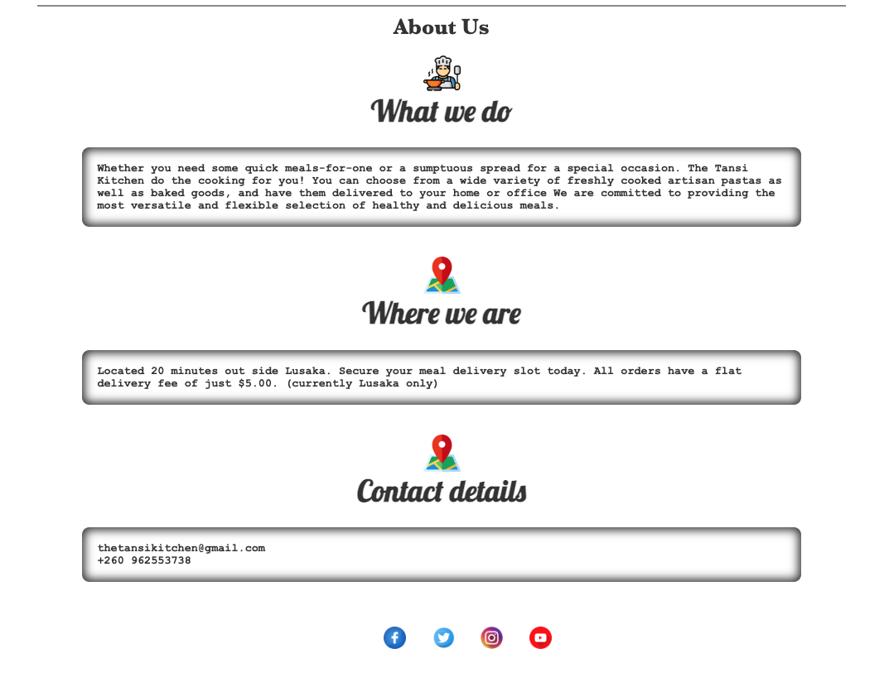

# Tansi Kitchen

The Tansi Kitchen is a local family business established in 2020. They started out modestly supplying their handmade ravioli and artisan breads, including sourdough loaves, to people putting together produce boxes for online stores, and quickly evolved into a thriving business from our farm outside Lusaka.  They supply small shops and delicatessens in Lusaka, with all kinds of pasta and sauces, including ravioli, tagliatelle, spaghetti, ready to cook lasagne, as well as bread and sourdough.

The web site aims to promote the products, showcase the various products, provide information about the history of the business, facilitate online ordering, build brand awarenes to a wider audience, and it will also help build customer loyalty by providing a convenient and reliable platform for customers to purchase their favorite products.

View the repository in GitHub
<a href="https://github.com/Guss2708/Tansi-kitchen" target="_blank" rel="noopener">here</a>

View the live project
<a href="https://8000-guss2708-tansikitchen-3gnlalldfxi.ws-eu38.gitpod.io/index.html" target="_blank" rel="noopener">here</a>

# Features

- ## Navbar  ##

>Featured on all three pages, the full responsive navigation bar includes links to the Logo, Home page, Products page and Sign Up page and is identical in each page to allow for easy navigation.

>This section will allow the user to easily navigate from page to page across all devices without having to revert back to the previous page via the ‘back’ button.

- ## Landing page ##

>The landing page includes a photos of the products with text above to allow the user to see exactly what the business is about and which location this site would be applicable to.

- ## About US page and Footer ##

>**What we do:** A brief explanation about the services provided and the commitments of the business.

>**Where we are:** Description of the location and the fees for delivery.

>**Contact details:** Gives the clients a email and the phonne number of the business. 

>**Footer:** The footer section includes links to the relevant social media sites for Tansi Kitchen. The links will open to a new tab to allow easy navigation for the user. The footer is valuable to the user as it encourages them to keep connected via social media.

- ## Product page ##

> Show pictures of the products the company produce and their ingredients.

- ## Sign-UP page ##

> This page will allow the user to get signed up to Tansi Kitchen. The user will be asked to submit their business details, full name and email address, for futher being contacted. 

- ## Testing ##

## User Stories

- As a user I would like to browse the website.
- As a user I need to easily find a contact number.
- As a user it is important I can find an email address.
- As a user I would like to be able to view the products available.
- As a user I need to be able to find various social media sites.
- As a user I need to be able to find price for the products
- As a user I would like different forms of contacting Tansi kitchen.
- As a user I need to be able to access the website from different devices.

Strategy

## Strategy
Having a online store is must these days. People are searching for products that are made in smal scale.
Considering that most business is performed online these days, it's more than a must to have an online presence.

Main directions of our development are:
- Having our potential clients to build their holiday package
- Addressing client's needs or queries by linking to our office

### Structure
These are the structure targets of the website.

Targets: 

- Navigation for the website
    - Menu bar.
    - Ease of access.
    - Digestible content.
- Different web pages for content
    - Home page.
    - Products page.
    - Contact Us page.
        - Contact details.
        - Contact Form.
    - Countries section.
    - Footer with links to external social platform pages.

#### Fonts

@import url('https://fonts.googleapis.com/css2?family=Libre+Baskerville:ital,wght@0,400;0,700;1,400&display=swap');
@import url('https://fonts.googleapis.com/css2?family=Lobster&display=swap');

